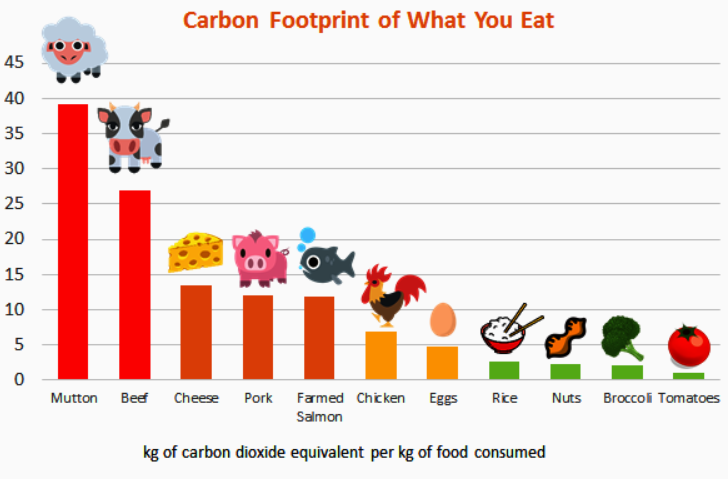
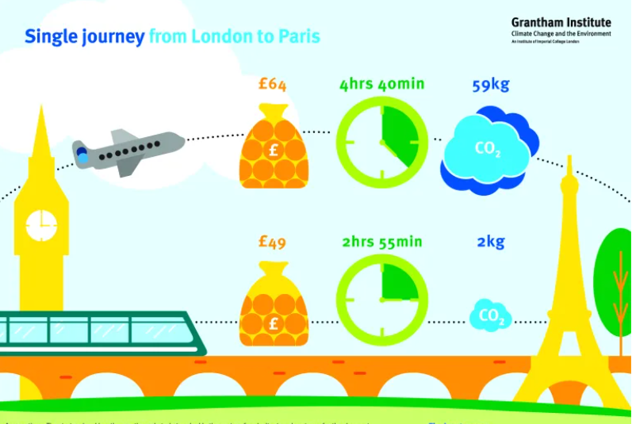
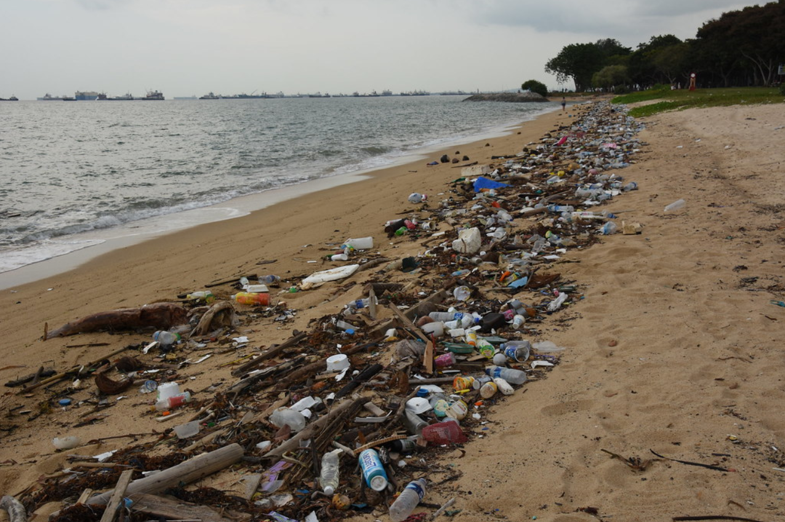

# Play Your Role To Impact Climate Change

The first step in the climate change battle is to understand how you are affecting climate change. You can learn how big your ecological footprint is by answering a few questions at [this simple website](https://www.footprintcalculator.org/home/en)

This Ecological Footprint Calculator not only tells you how much waste is being produced by your livestyle, but also gives solutions to different ways you can help reduce your carbon footprint from different ascpects of your lifestyle. The shocking reality is that most people living in the United States are living extremely wastefully. If every human being were to live like your typical American we would need 5 Earths to have enough space and resources for everyone to live sustainably. However, there are solutions to fix this and the change begings with YOU. 

## Eat Less Meats and Dairy

As we can see the production of meat and dairy releases many times more greenhouse gas emissions than the production of nuts and vegetables. This is caused by the cost of land from raising these animals to produce these meats and dairy. Factory farms are the largest users of land resources globally, and roughly 80% of the agricultural land use is used to grow crops to feed these farm animals. 60% of this land used to feed farm animals goes into beef production however beef is only about 2% of calories consumed worldwide. On top of this roughly 10% of waterflow worldwide is put towards feeding livestock. Lastly, the waste produced by livestock is one of the biggest contributers of releasing methane gas into the environment which is a greenhouse gas 86 times more of a potent than CO2.

## Avoid Fuel Based Transportation

The average American emitts close to 5 metric tons of carbon dioxide each year from driving their car. In California over 40% of all carbon emission comes from transportation vehicles. This is also one of the biggest categories in which we can improve on. Instead of driving your own vehicle to commute to school or work, we can ride a bike or scooter to drastically lower our carbon footprint. If biking is not possible then another alternative would be to use public transport. Although buses may be another contributor to releasing greenhouse gases, it is much more efficient with its emission due to the amount of people it carries. The final option would be to buy an electric or hybird vehicle instead of the typical fuel based vehicle. Although some electricity is currently be created by fossil fuels, the methods in which electricity are made are graudually becoming more clean.

## Be Mindful of Household Utility Usage

Small changes at your home could help the environment while also lowering some of your utility bills. The first and easiest change is to turn off any appliances when not in use. This may seem like an obvious thing but turning off light and unplugging appliances when they are not in use is a good habit that will both help the environment and lower your utility bills. Another simple change that could be made is to use more efficient light bulbs and faucets. Replacing regular light bulbs with LED light bulbs can help reduce energy usage. There are also shower and faucet heads that are made to be more water-efficient which cam help reduce the amount of water you use. There are also many other places for improvement such as taking shorter showers and turning off taps when while brushing you teeth or applying soap to your hands. Lastly turning down the air conditioner a few degrees is an easy way to help to environment. These small changes may seem insignificant indivually, however as they pile up together it makes a bigger difference than you would imagine.

## Cut Back on Consumption and Waste

Everything we use has a carbon footprint. Therefore, we should be careful in what we choose to buy and use. Avoid buying items that are single use and items that do not seem like they could be used for a very long time. These items include things such as bottled water, single use fashion items, and cheap products that can break easily. Before deciding to throw away a product it is also important to see if it can be repaired or reused in a different way. If you still decide to rid of the product figure out how it should be disposed. Often times many things that can be recycled or composted end up being throw into the garbage going into landfills. The biggest place Americans can improve on is composted food waste. Over 50% of waste in America is compostable material, and only 5% of food waste gets composted in America. By composting food waste not only are you helping create fertilizer for plants, you are preventing food waste from going to landfills and rotting and producing methane gas which is a greenhouse gas much more potent than carbon dioxide.
